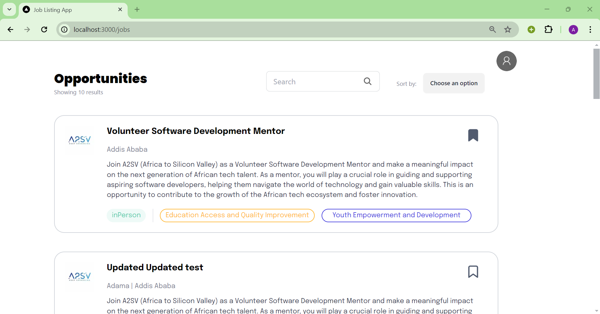
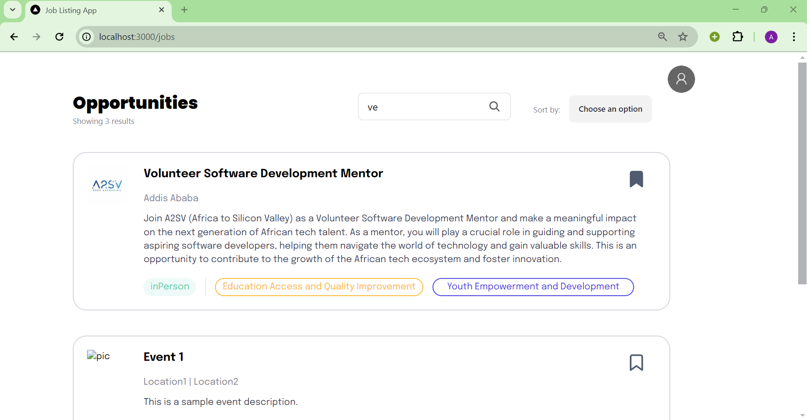
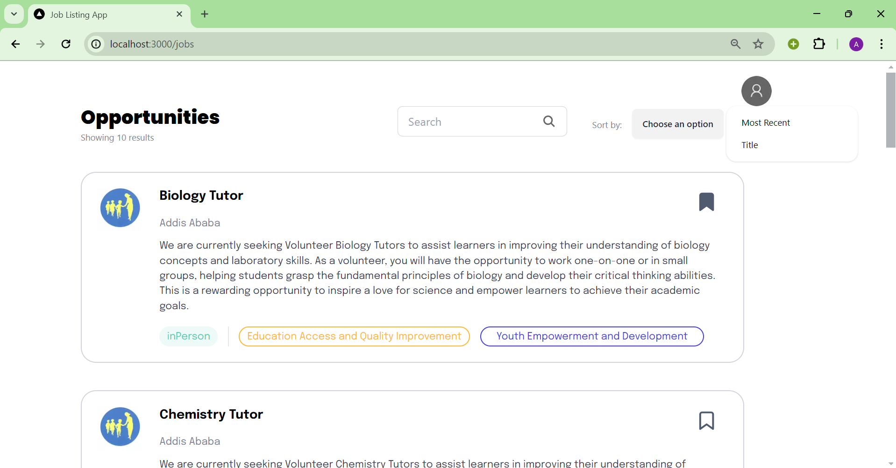
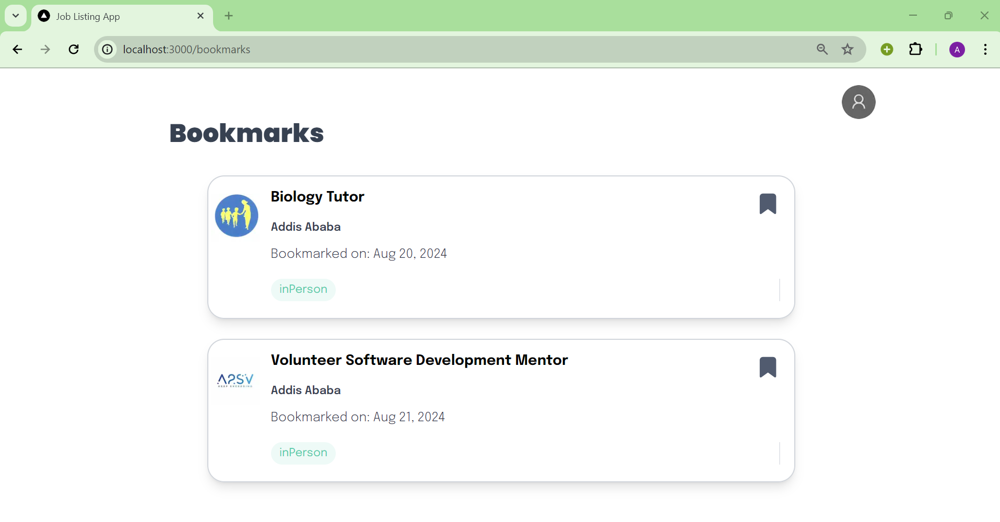
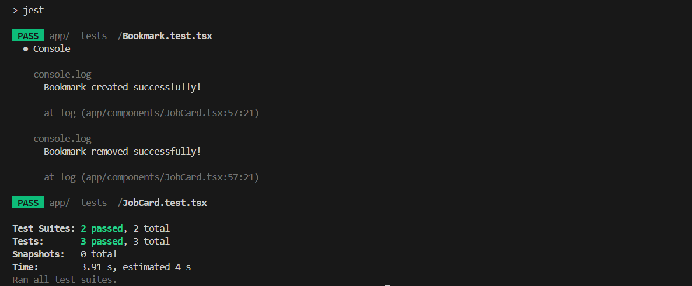
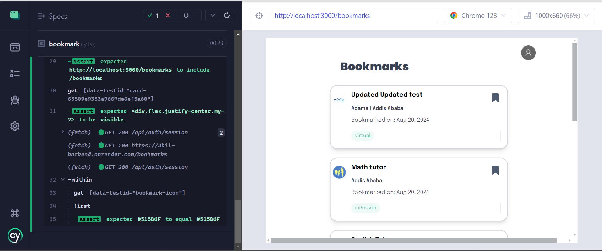

# JobListingApp_Bookmark
This is a job listing application.

## List of jobs
After a user logs in the following page will be shown from which a user can search for jobs by title or sort the jobs based on title or date.







## Bookmarking a job
Users can bookmark a job by clicking on the icon to the top right corner of the card and then go to the bookmarks page to view the list of bookmarks by clicking on the account and clicking on bookmarks.




## Unit tests and e2e test
Unit test to validate the functionality of bookmarking a job position and ensuring that the toggle button works as expected and testing to validate the rendering of the job posting cardhas been written using jest.

To test the bookmark functionality from a user's perspective e2e test is written using Cypress.






## To launch the website
You should have node installed.
Clone the repository and install dependencies by running the following commands:
```bash
git clone https://github.com/AregawiF/JobListingApp_Bookmark.git
cd Job_Listing_app_with_auth
npm install
npm run dev
''' then follow the link to launch the website.
